## Module 1: Learn the Fundamentals of Microsoft Dynamics 365 Supply Chain Management

## Lab 8 - Dynamics 365 Supply Chain Management capstone lab

## Objective

During this lab, you will explore product creation and pricing maintenance. You will also review core business processes of supply chains, such as inventory management, procurement, and sourcing.

## Lab Setup

- **Estimated time**: 45 minutes 

## Exercise 1: Explore Product Management

### Create a product

In Contoso Entertainment System USA (USMF), you need to create a new item for a newly configured speaker enclosure to be purchased from vendors.

1. On the Home page, in the top-right, verify the **USMF** company is selected.

1. If not, select the currently listed company and then change the company to **USMF**.

    

1. Using the navigation pane, select **Modules** > **Product information management** > **Products** > **Released products**.

    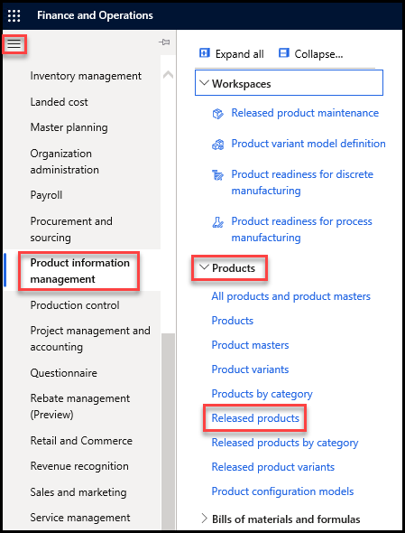

1. On the Released product details page, in the Action Pane, select **+ New**.

1. In the **New released product** pane, in the **Product type** menu, verify **Item** is selected.

1. In the **Product subtype** menu, verify **Product** is selected.

1. Select the **Tracking dimension group** menu, and then select **None**.

1. Under **IDENTIFICATION**, in the **Product number** box, enter **GTL201**.

1. In the **Product name** box, enter **Speaker Enclosure**.

1. Under **SALES TAXATION**, select the **Item sales tax group** menu, and then select **ALL**.

1. Under **PURCHASE TAXATION**, select **Item sales tax group** menu, and then select **ALL**.

1. Under **PRICES**, in the **Purchase price** box, enter **30.00**.

1. In the **Sales price** box, enter **30.00**.

1. Under **REFERENCE GROUPS**, select the **Item model group** menu, and then select **FIFO First In-First Out**.

1. Select the **Item group** menu, and then select **CarAudio**.

1. Select the **Storage dimension group** menu, and then select **SiteWH**.

1. Under **UNITS OF MEASURES**, verify the following values are set:

    | **Setting**| **Value**|
    | :--- | :--- |
    | Inventory unit| ea|
    | Purchase unit| ea|
    | Sales unit| ea|
    | BOM unit| ea|

    

1. Select **OK**. Select save on the top left corner.

1. To ensure the product is finalized, in the Action Pane, select **Product** and then, under **Maintain**, select **Validate**.

1. Verify you are presented with the information banner confirming that all required field values were validated.

    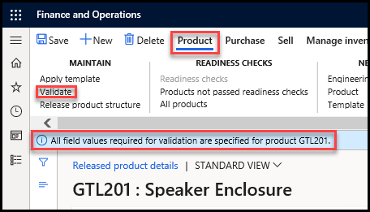

1. Close all pages and return to the Home page.

## Exercise 2: Explore Warehouse Management

### Create a warehouse

1. Using the navigation pane, select **Modules** > **Inventory management** > **Inventory breakdown** > **Warehouses**.

    

1. On the Warehouses page, in the Action Pane, select **New**.

1. In the **Warehouse** box, enter **150**.

1. In the **Name** box, enter **Outpost Warehouse**.

1. Select the **Site** menu, and then select **1 Home speakers production**.

1. Select the **Location names** FastTab.

1. The options in this section define the default format for location names.

1. Set the **Include aisle** and **Include rack** options to **Yes**.

1. Set the **Include shelf** option to **Yes**.

1. In the **Format** box, for the shelf, enter **-##**.

1. In the Action Pane, select **Warehouse**.

    

1. Under **Maintain**, select **Location Wizard**.

    

1. On the Welcome page, review the information and then, in the lower right corner, select **Next**.

1. Clear the **Inbound docks** and **Bulk locations** check boxes.

    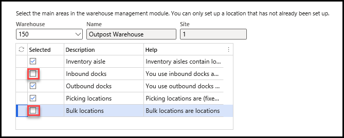

1. Select **Next** and review the information.

1. Continue to each page and then, when complete, select **Finish**.

1. Close the page and return to the Home page.

### Create a trade agreement for sales price

1. Using the navigation pane, select **Modules** > **Product information management** > **Products** > **Released products**.

    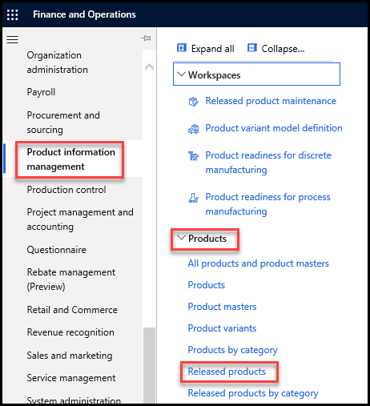

1. On the Released products details page, search for the item number **GTL201**.

1. To the left of **GTL201**, select the **Select or unselect row** check box.

1. In the Action Pane, select **Sell** and then, under **TRADE AGREEMENTS**, select **Create trade agreements**.

    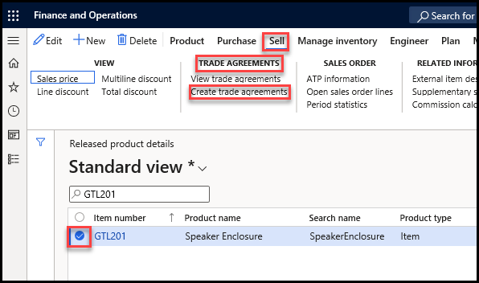

1. In the Action Pane, select **+New**.

1. Select the **Name** column, select the menu and then select **S_Price**.

1. In the Action Pane, select **Lines**.

    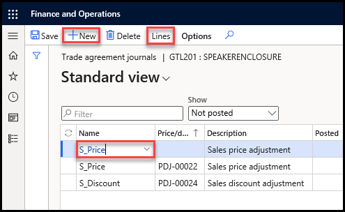

1. On the Journal lines, trade agreement page, in the **Item relation** column, select the menu and then select **GTL201**.

1. This is the item number of the product you created.

1. In the **Warehouse** column, select the menu and then select **150**.

    

1. You may have to scroll right to see the column.

1. In the **Amount in currency** column, in the box, enter **100.00**.

1. In the Details section, in the **From date** box, enter the first date of the current year.

1. In the Action Pane, select **Validate** > **Validate all lines.**

    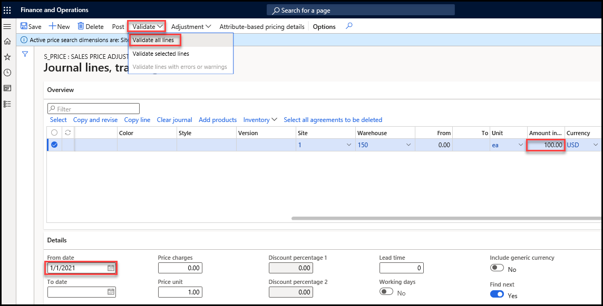

1. In **the Price/discount Journal posting** pane, select **OK**.

1. Verify there are no errors.

1. In the Action Pane, select **Post**.

1. In the **Price/discount Journal posting** pane, select **OK**.

1. Verify the operation completed.

1. Close the page.

    

1. On the Released product details page, in the Action Pane under **Sell** > **TRADE AGREEMENTS,** select **View trade agreements**.

    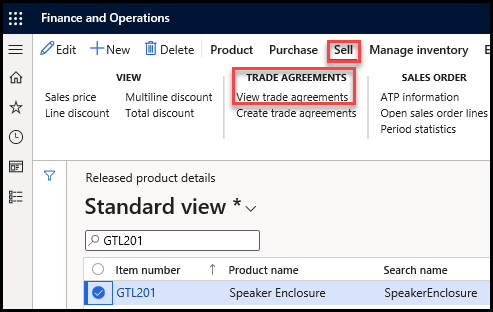

1. The trade agreement should be posted. Review the line to observe the price information.

1. Close the pages and return to the Home page.

## Exercise 3: Explore Production Management

### Create a production order for a product

1. Using the navigation pane, select **Modules** > **Production control** > **Production orders** > **All production orders**.

    

1. In the Action Pane, select **New production order**.

1. In the **Create production order** pane, under **IDENTIFICATION**, in the **Item number** box, enter **D0004,** and then select the identified item.

1. Under **PRODUCTION**, in the **Delivery** box, select a date one month from today's date.

1. The delivery date indicates when the production order should end in order to deliver on time. This date can be used in the scheduling process. For example, you can schedule the order backward from the delivery date.

1. In the **Quantity** box, enter **30**

1. Select **Create**.

    

1. Close all pages and return to the Home page.

## Exercise 4: Explore Inventory Management

### Create a count journal with the product for the created warehouse

1. Using the navigation pane, select **Modules** > **Inventory management** > **Journal entries** > **Item counting > Counting**.

    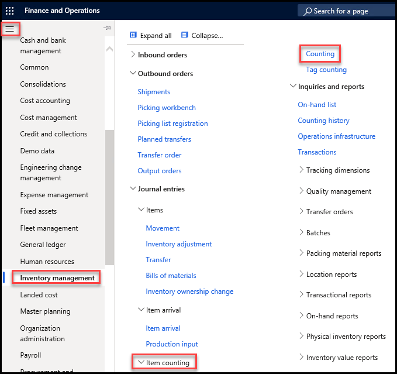

1. In the Action Pane, select **+New**.

1. In the **Create inventory journal** pane under **Counting by**, select the **Warehouse** toggle switch to set it to **Yes**.

1. Select **OK**.

    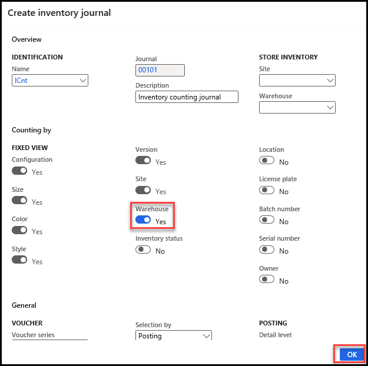

1. On the Inventory counting journal page, in the **Journal header details** FastTab, under **Journal lines** on the toolbar, select **+New**.

    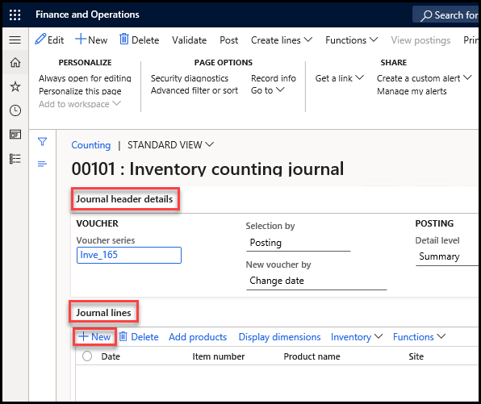

1. In the **Item number** column, select the menu and then select **GTL201**.

1. In the **Warehouse** column, select the menu and then select **150**.

1. In the **Counted** box, enter **100.00**.

1. This will specify the number of items stored in the warehouse for this product.

    

1. In the Action Pane, select **Validate**.

1. In the **Check journal** pane, select **OK**.

1. In the Action Pane, select **Post**.

1. On the **Post journal** pane, select **OK**.

1. Close all pages and return to the Home page.

### Check on-hand inventory for the product

1. Using the navigation pane, select **Modules** > **Inventory management** > **Inquiries and reports** > **On-hand list**.

    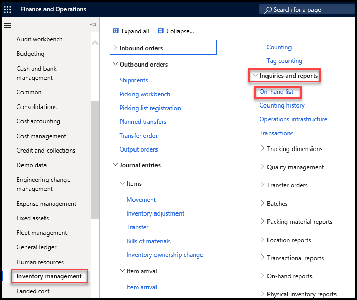

1. In the Action Pane, select **Dimensions**.

1. On the **Dimension display** pane, under **STORAGE DIMENSIONS**, select the **Site** and **Warehouse** check boxes then select **OK**.

    

1. In the **Filters** pane, select **Apply**.

1. Locate and review the on-hand inventory for **GTL201**.

    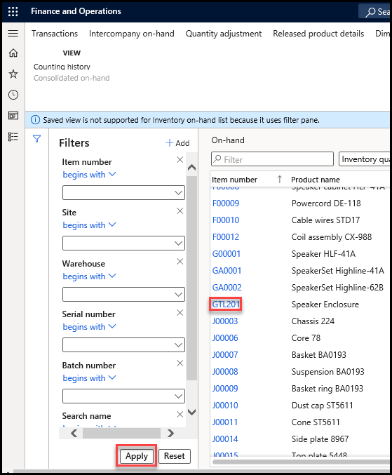

1. Close all pages and return to the Home page.

## Exercise 5: Explore Procurement and Sourcing

### Create a purchase order with a product

1. Using the navigation pane, select **Modules** > **Procurement and sourcing** > **Purchase orders** > **All purchase orders**.

    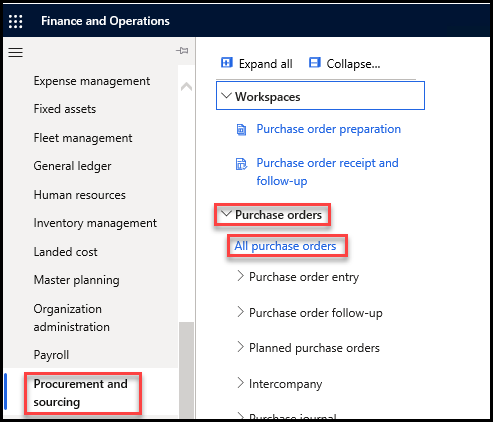

1. On the All purchase orders page, in the Action Pane, select **+ New**.

1. In the **Create purchase order** pane, select the **Vendor account** menu, and then select **US-101**.

1. When you select a vendor, details from the vendor record, such as address, invoice account, delivery terms, and delivery mode, will be copied as default values into the order header. You can change these values at any time.

1. In the **General** section, under **STORAGE DIMENSIONS**, select the **Site** menu, and then select **1 Home speakers production**.

1. Under **DATES**, select a **Delivery date** for one week from today's date.

1. Select **Administration**.

1. Select the **Orderer** menu and then select **Lars Giusti** to specify who is placing the order.

1. In the **Create purchase order** pane, select **OK**.

    

1. On the toolbar, select **Purchase order line**.

1. Under **DISPLAY**, select **Dimensions**.

    

1. In the **Dimensions display** pane, under **PRODUCT DIMENSIONS**, select the **Color** check box.

1. Select **OK**. 

1. In **Item number** column, select the menu and then select **T0005**.

1. In the **Color** column, select the menu and then one of the colors.

1. In the **Quantity** box, enter **15**.

    

1. Under the **Purchase order lines**, at the bottom of the page, select the **Line details** FastTab.

1. This tab may already be expanded.

1. Select the **Delivery** tab and, in the **Delivery date** box, use the currently assigned date or enter a future date.  
    A unique delivery date can be assigned to each order line. The date is inherited from the field on the purchase order header, but you can change this.

1. Write down your purchase order number. You will need this later.

1. In the Action Pane, select **Save**.

    

1. Close the Purchase order line page.

1. On the All purchase orders page, use the **Filter** feature to find your new purchase order.

1. When complete, close the All purchase orders page and return to the Home page.
