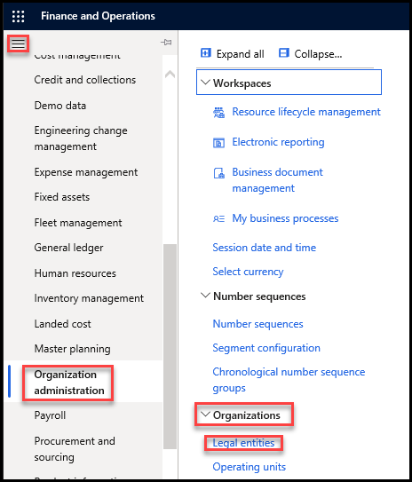
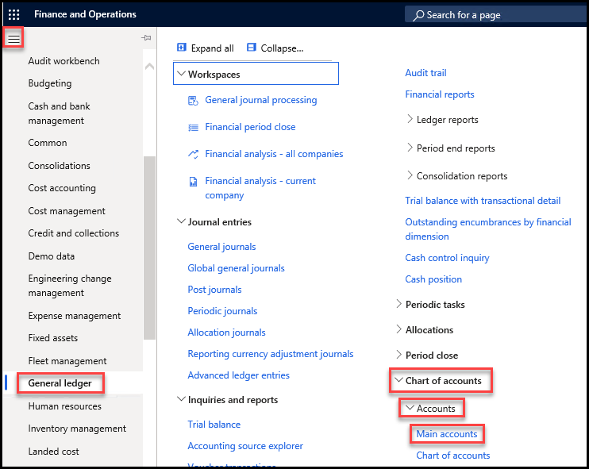
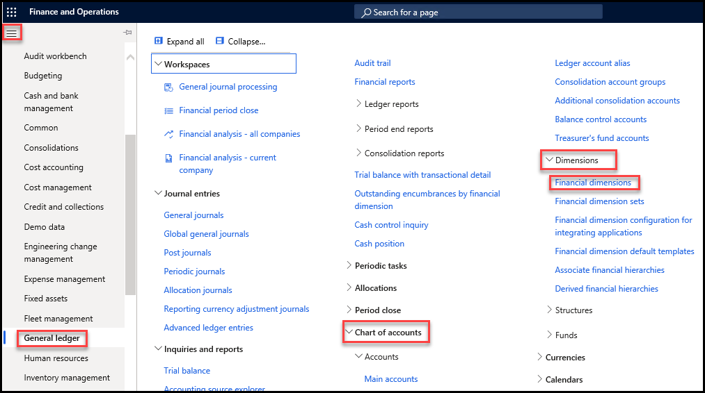
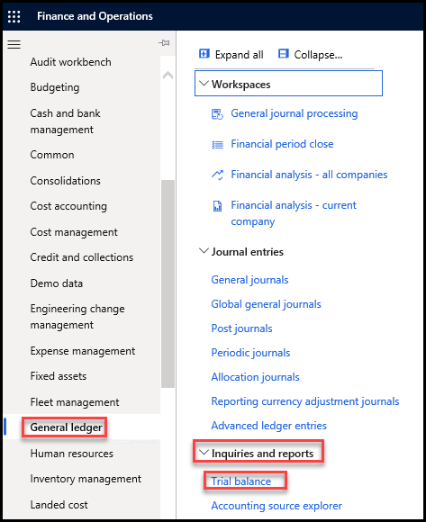
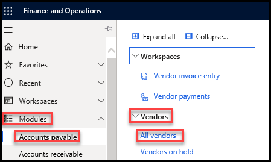
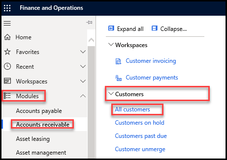
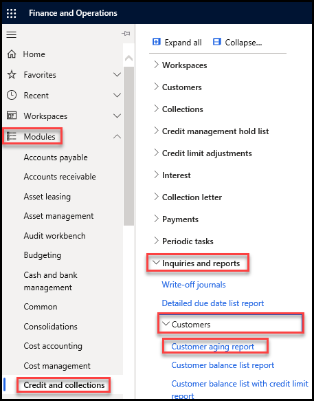
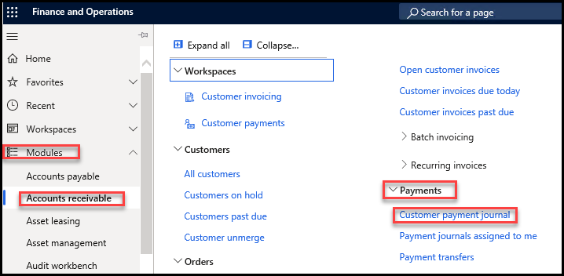

## Module 2: Learn the Fundamentals of Microsoft Dynamics 365 Finance

## Lab 3 - Dynamics 365 Finance capstone lab

## Objective

During this lab, you will explore the core capabilities of Microsoft Dynamics 365 Finance. You will explore the general ledger by creating a new entity, adding a new account and dimension values, and running a trial balance. You'll also explore accounts payable by creating a new vendor, purchase order, and invoice, and then settling the invoice. Finally, you'll explore accounts receivable by creating a new customer, an invoice, and an aging report, and then applying the customer payment.

## Lab Setup

   - **Estimated time**: 45 minutes

## Exercise 1: Explore the General Ledger

### Create a new legal entity

1. Using the navigation pane, select **Modules** > **Organization administration** > **Organizations** > **Legal entities**.

    

1. In the Action Pane, select **+New** to create a new legal entity.

1. In the **New entity** pane, create a new entity using the following information and then select **OK**:

    | **Setting** | **Value** |
    | :--- | :--- |
    | Name | Contoso Training USA |
    | Company | USTR |
    | Country/region | USA |

1. On the Legal entities page, select the **Addresses** FastTab and then select **Edit**.

1. In the fact box, enter the following updates and then select **OK**:

    | **Setting**| **Value**|
    | :--- | :--- |
    | ZIP/postal code| 98052|
    | Street| 123 Main Street|
    | Primary for country/region | Verify **Yes** is selected |

1. Select the **Contact information** FastTab.

1. Select **+Add** and then enter the following contact information:

    | **Setting**| **Value**|
    | :--- | :--- |
    | Description| Main Office|
    | Contact number/address| 888-555-1234|
    | Primary| Select the check box |

1. Select the **Tax registration** FastTab.

1. In the **Tax registration number** box, enter **88-1234567**.

1. In the Action Pane, select **Save**.

1. In the navigation pane, select **Home**.

### Create a new account in an existing chart of accounts

1. On the Home page, in the top-right, verify the **USMF** company is selected.  
    If not, select the currently listed company and then change the company to **USMF**.

1. Using the navigation pane, select **Modules** > **General ledger** > **Chart of accounts** > **Accounts** > **Main accounts**.

    

1. In the Action Pane, select **+New** to create a new revenue account.

1. On the Main accounts page, enter the following updates:

    | **Setting**| **Value**|
    | :--- | :--- |
    | Main Account| 401500|
    | Name| Training Revenue|
    | Main account type| Revenue |

1. In the Action Pane, select **Save**.

### Add a new dimension value

1. Using the navigation pane, select **Modules** > **General ledger** > **Chart of accounts** > **Dimensions** > **Financial dimensions**.

    

1. In the navigation list, select **ServiceLine**.  
    You may also use the **Filter** box to search for **ServiceLine**.

1. In the Action Pane, select **Dimension values**.

1. In the Action Pane, select **+New**.

1. In the **Dimension value** and **Description** boxes, enter **Training Services**.

1. In the Action Pane, select **Save**.

### Use an account and dimension value in a general journal

1. Using the navigation pane, select **Modules** > **General ledger** > **Journal entries** > **General journals**.

    

1. In the Action Pane, select **+New**.

1. In the first row of the list, in the **Name** column, select the menu and then select **General Journal**.

1. In the Action Pane, select **Lines**.

1. In the list, in the **Date** column, select the calendar icon and then change the date to the 1st of the month.

1. In the **Account** column, select the menu and then enter the following updates:

    | **Setting**| **Value**|
    | :--- | :--- |
    | MainAccount| 601200|
    | BusinessUnit| 004|
    | Department| 025|
    | CostCenter| 009|
    | ItemGroup| Services|

1. In the **Description** box, enter **Expense Reclass**.

1. In the **Debit** box, enter **1000.00**.

1. Scroll to the right and, in the **Offset account** column, select the menu and then enter the following updates:

    | **Setting**| **Value**|
    | :--- | :--- |
    | MainAccount| 602200|
    | BusinessUnit| 004|
    | Department| 025|
    | CostCenter| 009|
    | ItemGroup| Services|

1. In the Action Pane, select **Save**.

1. In the Action Pane, select **Validate** > **Validate**.  
    Wait for the journal validation to complete.

1. Review the warning banner.  
    This warning message can be ignored for this lab.

1. In the Action Pane, select **Post**.

### Run a trial balance using a dimension set

1. Using the navigation pane, select **Modules** > **General ledger** > **Inquiries and reports** > **Trial balance**.

    

1. On the Trial balance page, select **Calculate balances**.

1. The **Calculate balances** button is located under the **DATA TO INCLUDE** settings.

1. In the table, review the results.

1. On the Trial balance page, under **Standard View**, expand **Parameters**.

1. Under **DATA TO INCLUDE**, select the **Financial dimension set** menu and then select **MA-BU-DEPT-CC**.

1. Select **Calculate balances** to view the dimensions used in the journal.

1. Close the page.

## Exercise 2: Explore Accounts Payable

### Create a vendor

1. Using the navigation pane, select **Modules** > **Accounts Payable** > **Vendors** > **All vendors**.

    

1. In the Action Pane, select **+New** to create a vendor.

1. On the New Record page, create a new vendor using the following information:

    | **Setting**| **Value**|
    | :--- | :--- |
    | Vendor account| V00001|
    | Name| ABC Training, Inc|
    | Group| 20|

1. In the Action Pane, select **Save**.

1. Select the **Addresses** FastTab and then select **+Add**.

1. In the New address pane, enter the following updates, then select **OK**:

    | **Setting**| **Value**|
    | :--- | :--- |
    | Name or description| Main Office|
    | ZIP/postal code| 98052|
    | Street| 123 Front Street|

1. In the Action Pane, select **Save**.

1. Select the **Payment** FastTab.

1. Select the **Method of payment** menu and then select **CHECK**.

1. Select the **Tax 1099** FastTab and then enter the following updates:

    | **Setting**| **Value**|
    | :--- | :--- |
    | Report 1099| Yes|
    | Federal tax ID| 82-1234567|
    | Tax ID type| Employer Identification Number|
    | 1099 box| MISC-03|

1. In the Action Pane, select **Save**.

1. Close the form.

### Create a purchase order for the new vendor

1. On the V00001 : ABC Training, Inc page, in the Action Pane, select **Procurement.**

1. In the Action Pane, under the **NEW** tab, select **Purchase order**.

1. On the Purchase order page under **Purchase order lines**, enter the following updates:

    | **Setting**| **Value**|
    | :--- | :--- |
    | Item number| S0001|
    | Quantity| 2|

    >[!NOTE] You will need to scroll right to see the **Quantity** column.

1. In the Action Pane, select **Save**.

1. In the Action Pane, select **Purchase** and then, under the **ACTIONS** tab, select **Confirm**.

### Record vendor invoice for the purchase order

1. In the Action Pane, select **Invoice**.

1. Under the **GENERATE** tab, select **Invoice**.

1. In the Action Pane, select **Default from: Product receipt quantity**.

1. In the **Default quantity for lines** menu, select **Ordered quantity** and then select **OK**.

1. On the Vendor invoice page, enter the following updates:

    | **Setting**| **Value**|
    | :--- | :--- |
    | Number| INV001|
    | Invoice description| Initial Installation Service|
    | Invoice date| *enter today's date*|

1. In the Actions Pane, select **Save**.

1. In the Action Pane, select **Update match status**.

1. In the Action Pane, select **Post**.

### Settling the vendor invoice

1. Using the navigation pane, select **Modules** > **Accounts payable** > **Payments** > **Vendor payment journal**.

    

1. In the Action Pane, select **+New**.

1. On the Vendor payment journal page, in first row, in the **Name** column, select the menu and then select **VendPay**.

1. In the Action Pane, select **Lines** to record a payment.

1. On the Vendor payments page, in the **Account** box, enter **V00001**.

1. On the toolbar, select **Settle transactions**.

1. On the Settle transactions for ABC Training, Inc page, in the **Mark** column, select the check box.

1. In the lower-right corner, select **OK**.

1. In the Action Pane, select **Generate payments**.

1. In the **Generate payments** pane, enter the following updates and then select **OK**:

    | **Setting**| **Value**|
    | :--- | :--- |
    | Method of payment| CHECK|
    | Bank account| USMF OPER|

1. In the **Payment by check** pane, review the information and then select **OK**.

    **ALERT**: You will see an error stating **Unable to find printer with path**. This should be ignored. No printer is installed in the lab.

1. Scroll right and in the **Payment status** column, verify **Sent** is displayed.

1. In the Action Pane, select **Validate** > **Validate**.

1. In the Action Pane, select **Post**.

## Exercise 3: Explore Accounts Receivable

### Create a customer

1. Using the navigation pane, select **Modules** > **Accounts receivables** > **Customers** > **All customers**.

    

1. In the Action Pane, select **+New** to create a customer.

1. In the **Create customer** pane, create the new customer using the following information and then select **Save**:

    | **Setting**| **Value**|
    | :--- | :--- |
    | Customer account| US-901|
    | Name| Fabrikam Consulting Services|
    | Customer group| 30|
    | ZIP/postal code| 98052|
    | Street| 123 Middle Street|

1. On the US-901 Fabrikam Consulting Services page, select the **Payment defaults** FastTab.

1. Select the **Method of payment** menu and then select **CHECK**.

1. Select the **Financial dimensions** FastTab.

1. In the **BusinessUnit** box, enter **004**.

1. In the Action Pane, select **Save**.

### Create a free text invoice for the new customer

1. In the Action Pane, select **Invoice** and under the **NEW** tab, select **Free text invoice**.

1. On the US-901 Fabrikam Consulting Services page, under the **Free text invoice** **header**, set the **INVOICE** date to today's date.

1. Under **Invoice lines**, make the following changes:

    | **Setting**| **Value**|
    | :--- | :--- |
    | Description| Consultant Service Training|
    | Main account| 401200|
    | Sales tax group| WA|
    | Amount| 1500.00|

1. In the Action Pane, select **Sales tax**.

1. On the Sales tax transactions page, review the record and then select **OK**.

1. In the Action Pane, select **Post**.

1. In the **Posrt free test invoice** pane, under **PRINT OPTIONS**, set **Print invoice** to **Yes** and then select **OK**.

1. On the **Print destination settings** pane, select **OK** to print the invoice to the screen.

1. Review the invoice and then, when complete, close the invoice.

1. Close the form.

### Run an accounts receivable aging report to check

1. Using the navigation pane, select **Modules** > **Credit and collections** > **Inquiries and reports** > **Customers** > **Customer aging report**.

    

1. In the **Customer aging report** pane, enter the following updates and then select **OK**:

    | **Setting**| **Value**|
    | :--- | :--- |
    | Aging as of| Today's date|
    | Aging period definition| 30_60_90_180|
    | Details| Yes|

1. In the Customer aging report, select the **Next Page** down arrow icon and then scroll to the last page.
    Review the invoice that was created for the US-901 customer.

1. Close the form.

### Apply customer payment for the free text invoice

1. Using the navigation pane, select **Modules** > **Accounts receivables** > **Payments** > **Customer payment journal**.

    

1. In the Action Pane, select **+New**.

1. On the Customer payment journal page in the **Name** column, select the menu and then select **CustPay**.

1. In the Action Pane, select **Enter customer payments**.

1. In the **Customer** box, enter **US-901**.  
    Wait for the data to load and then, in the **Mark** column, select the check box.

1. Above the grid, in the **Amount** box, enter **1597.50**.The amount shown in the **Remaining amount** box should automatically change from **1,597.50** to **0**.  
    You may need to select an empty space for the value to calculate.

1. In the **Payment reference** box, enter **Check# 123**.

1. In the Action Pane, select **Save in journal**.

1. Close the form.

1. In the Action Pane, select **Lines**.

1. In the Action Pane, select **Validate** > **Validate**.

1. In the Action Pane, select **Post**.
