## Module 3: Learn the Fundamentals of Microsoft Dynamics 365 Commerce

## Lab 3 - Dynamics 365 Commerce capstone lab

## Objective

During this lab, you will explore the basics of Commerce headquarter setup. The core features include retail channel setup, assortment creation, and retail discount configuration.

## Lab Setup

   - **Estimated time**: 30 minutes 

## Instructions

## Exercise 1: Explore Commerce Headquarters

### Create a new store

1. On the landing page, in the top-right, verify the **USRT** company is selected.

1. If not, select the currently listed company and then enter **USRT**.

    

1. Using the navigation pane, select **Modules** > **Retail and Commerce** > **Channels** > **Stores** > **All Stores**.

    

1. In the Action Pane, select **+New** to create a new store.

1. In the New record window, use the settings in the following table to update the values:

    | **Setting**| **Value**|
    | :--- | :--- |
    | Name| Seattle Flagship Store|
    | Store number| 000098|
    | Warehouse| Seattle|
    | Shipping warehouse| Seattle|
    | Store time zone| (GMT-08:00) Pacific Time|
    | Functionality profile| FN001|
    | Inventory lookup| Yes|
    | Channel profile| Default|
    | Offline profile| Default|
    | Sales tax group| WA|
    | Use destination-based tax| Yes|
    | Customer address book| RetailCust|
    | Employee address book| Seattle|
    | Default customer| 3002|

1. In the Action Pane, select **Save**.

    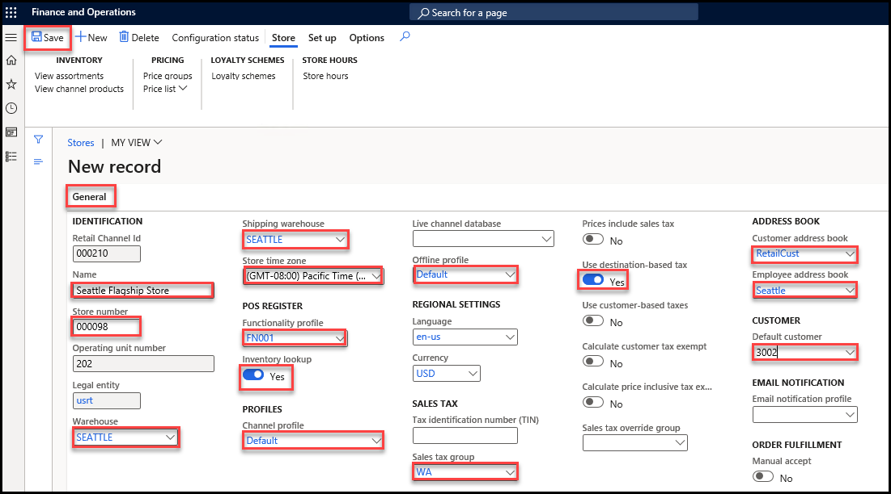

1. Select the **Statement/closing** FastTab and then enter the following updates:

    | Setting| Value|
    | :--- | :--- |
    | Statement amount calculation| Last|
    | Maximum Difference > Posting| 100.00|

    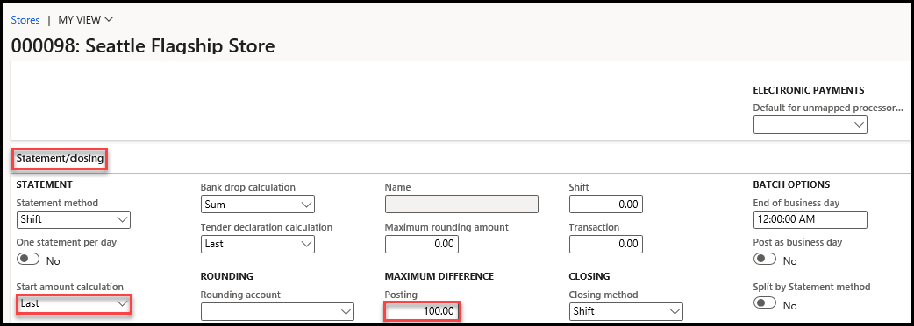

1. Select the **Financial dimensions** FastTab and then enter the following updates:

    | Setting| Value|
    | :--- | :--- |
    | BusinessUnit| 004|
    | RetailChannel| 000210|

    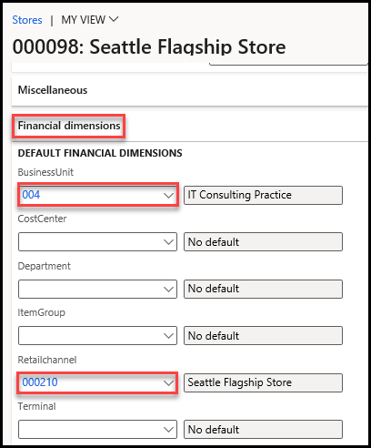

1. Select the **Screen layout** FastTab.

1. In the **Screen layout ID** box, enter **A2CP16:9C**.

1. In the Action Pane, select **Save**.

    

1. In the Action Pane, select **Set-up** and then, in the **COPY** tab, select **Copy all**.

    

1. In the **Copy all** pane, select the **From store** menu and then select **ANNAPOL**.

1. If necessary, select the **To store** menu and then select **00098**.

1. Select **OK**.

    

1. Verify the success message is displayed and then close the page.

### Add a group of products to an assortment and publish

1. Using the navigation pane, select **Modules** > **Organization administration** > **Organizations** > **Organization hierarchies**.

    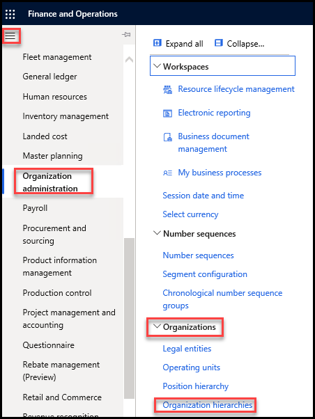

1. In the navigation list, select **Retail Stores by Region**.

1. In the Action Pane, select **View**.

    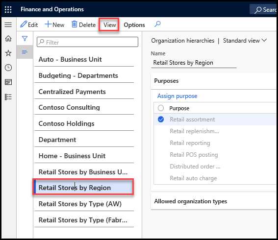

1. On the Hierarchy designer page, in the Action Pane, select **Edit**.

1. On the **West** tile, select the ellipsis (**...**) icon.

1. On the Hierarchy designer page, select **Insert** > **Retail channel**.

    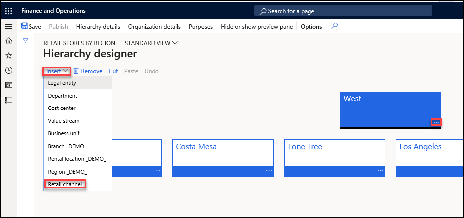

1. In the **Retail channel** pane, select **Seattle Flagship Store** and then select **OK**.

    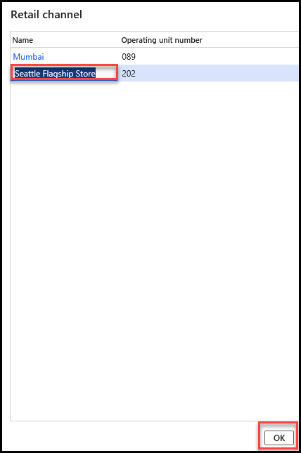

1. In the Action Pane, select **Save**.

1. In the dialog box, review the information and then select **Close**.

1. In the Action Pane, select **Publish**.

1. In the **Publish changes** pane, in the **Effective date** box, select the first day of the current month.

1. In the **Describe changes** box, enter **Addition of Seattle Flagship Store** and then select **Publish**.

    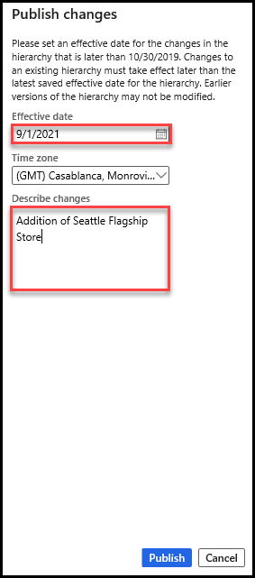

1. In the dialog box, review the information and then select **Close**.

1. In the Action Pane, select **Save**.

1. In the dialog box, review the information and then select **Close**.

1. Close the page.

1. Using the navigation pane, select **Modules** > **Retail and Commerce** > **Catalogs and assortments** > **Assortments**.

    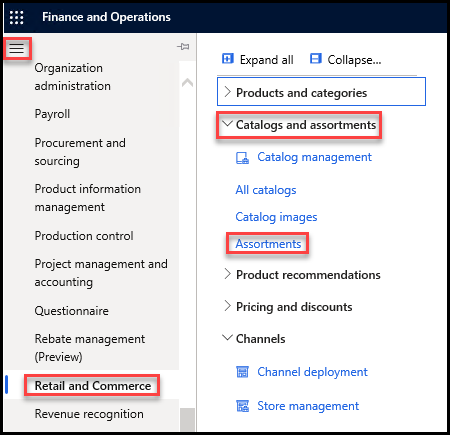

1. On the Assortments page, select **AW-Outlet**.

1. In the Action Pane, select **Edit**.

1. In the dialog box, select **Yes** to confirm the edit selection.

1. On the AW-Outlet page, select the **Commerce channel** FastTab.

1. On the toolbar, select **+Add line**.

    

1. In the **Choose organization nodes** pane, select the **Organization hierarchy** menu and then select **Retail Stores by Region**.

1. Under **AVAILABLE ORGANIZATION NODES**, select **Seattle Flagship Store** and then select the **Add** right arrow icon to add it to **SELECTED ORGANIZATION NODES**.

1. Select **OK**.

    

1. In the Action Pane, select **Publish**.

1. In the dialog box, review the information and then, select **Yes**.

1. In the Action Pane, select **Edit**.

1. In the **confirmation** dialog box, select **Yes**.

1. On the AW-Outlet page, select the **Products** tab.

1. On the AW-Outlet page, select **+Add line**.

1. Select the **Category** menu, select **Team Sports**, and then select **OK**.

    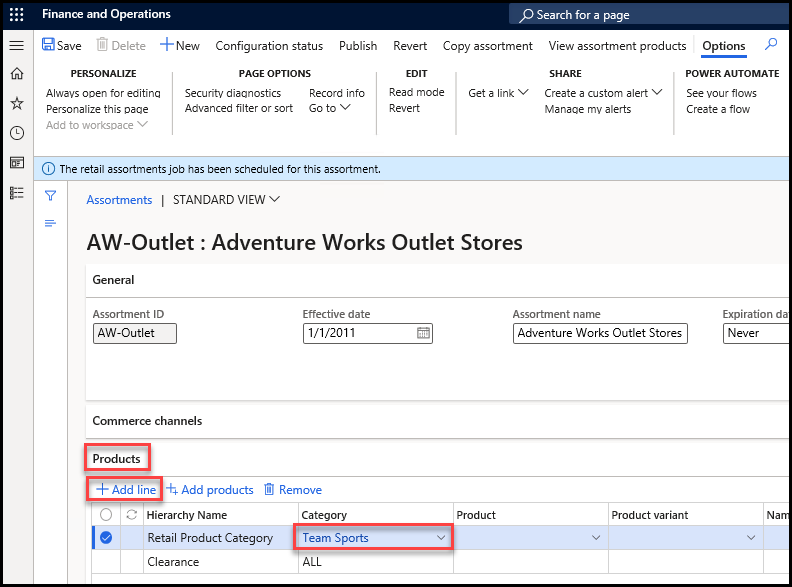

1. In the Action Pane, select **Publish**. In the dialog box, review the information and then, select **Yes**.

### Run the retail scheduler job for products

1. Using the navigation pane, select **Modules** > **Retail and Commerce** > **Retail and Commerce IT** > **Distribution schedule**.

    

1. In the navigation list, select **1040 (Products)**.

1. In the Action Pane, select **Run now**.

    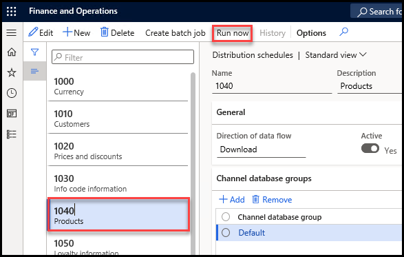

1. In the **Incremental sync with schedule '1040'** pane, review the information and then select **OK**.

### Create a new product discount

1. Using the navigation pane, select **Modules** > **Retail and Commerce** > **Pricing and discounts** > **All discounts**.

    

1. In the Action Pane, select **New** > **Discount**.

1. On the Discounts page, in the **Name** box, enter **Store Opening**.

1. On the **Details** FastTab, in the **Description** box, enter **Store Opening 20% Off**.

1. On the **Price/discount** FastTab, in the **Discount percentage** box, enter **20.00**.

1. On the **Validation period** FastTab, in the **Effective date** box, enter a date from the previous month.

1. In the **Expiration date** box, enter a date one week from the current date.

    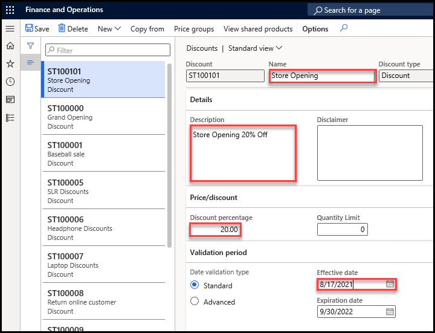

1. On the **Lines** FastTab, on the toolbar, select **+ Add**.

1. Under the **Category** column, select the menu, select **Team Sports**, and then select **OK**.

1. In the Action Pane, select **Save**.

    

1. In the Action Pane, select **Price groups**.

1. On the Price groups page, select the **Price groups** menu and then select **West**.

1. In the Action Pane, select **Save**.

    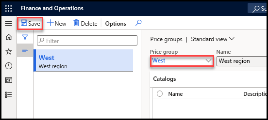

1. Using the navigation pane, select **Modules** > **Retail and Commerce** > **Pricing and discounts** > **All discounts**.

    

1. In the navigation list, select **ST100101**. Use serach option if you can't find it in the list

1. On the **General** FastTab, select the **Status** menu and then select **Enabled**.

1. In the Action Pane, select **Save**.

    

1. Close the form.

1. Using the navigation pane, select **Modules** > **Retail and Commerce** > **Retail and Commerce IT** > **Distribution schedule**.

    

1. In the navigation list, select **1020 (Products)**.

1. In the Action Pane, select **Run now**.

    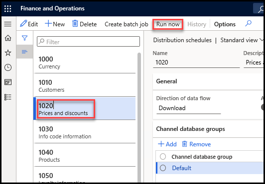

1. In the **Incremental sync with schedule '1020'** pane, review the information and then select **OK**.
