## Module 4: Learn the Fundamentals of Microsoft Dynamics 365 Human Resource

## Lab 1 - Dynamics 365 Human Resources capstone lab

## Objective

During this lab, you will explore the onboarding process for a new employee, including the creation of an employee record. You will also review the performance review process involving goal setting and performance rating. Additionally, you will use self-service features to submit an expense report.

## Lab Setup

- **Estimated time**: 20 minutes 

## Exercise 1: Explore Human Resources

### Create a new hire record

1. On the Finance and Operations Home page, in the top right, verify you are working with the USMF company.

1. If necessary, select the company and from the menu, select **USMF**.

    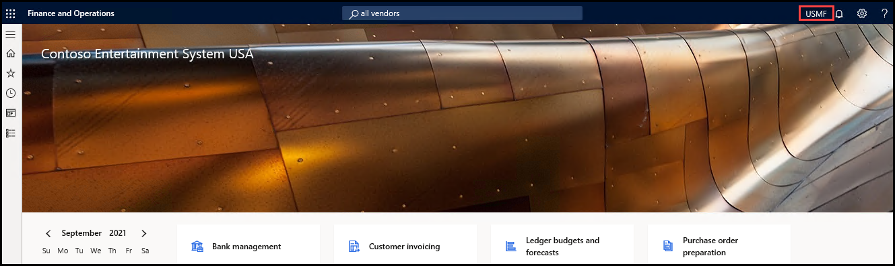

1. Using the navigation pane, select **Modules** > **Human resources** > **Positions** > **Positions**.

    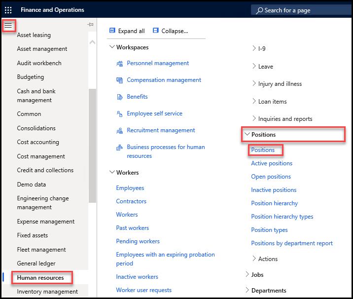

1. In the Action Pane, select **+New** to create a new position.

1. On the **Create new position** dialog box, select the **Job** menu then select **Store Manager**.

1. Select **Create position**.

    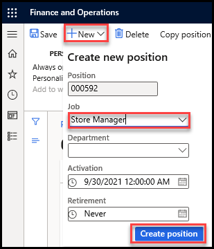

1. Using the navigation pane, select **Modules** > **Human resources** > **Workers** > **Employees**.

    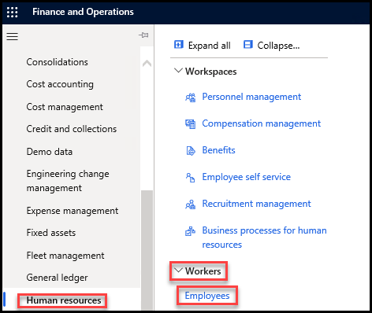

1. In the Action Pane, select **+New** to create a new employee.

1. In the **Hire new worker** pane, enter the following updates then select **Hire and add details**.

    | **Setting** | **Value** |
    | :--- | :---- |
    | First name | Bill |
    | Last name | Smith |
    | Employment start date | Select the current date|
    
    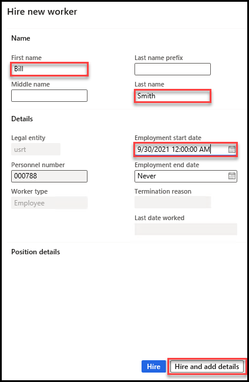

   **NOTE**: If you get error related to 'populate the data by running the ‘Populate project resources across all companies’ batch job' follow the following steps

1. Cancel the process and Refresh your browser, and then go to **Project management and accounting > Periodic > Project resources > Synchronize resource calendars capacity across all companies**.

    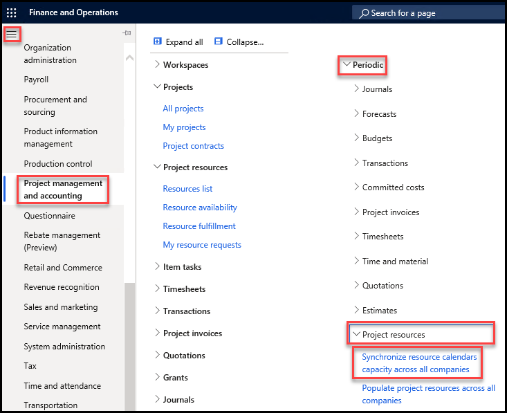

1. Set Remove existing capacity records to **Yes** to remove previous data. If you want generate incremental data, set it to **No**.

1. In the Period code field, select the period in which data should be generated. If you select a period code, a start and end date do not need to be defined.

1. If you leave the Period code field blank, select specific start and end dates to generate data.

1. Select **OK**.

    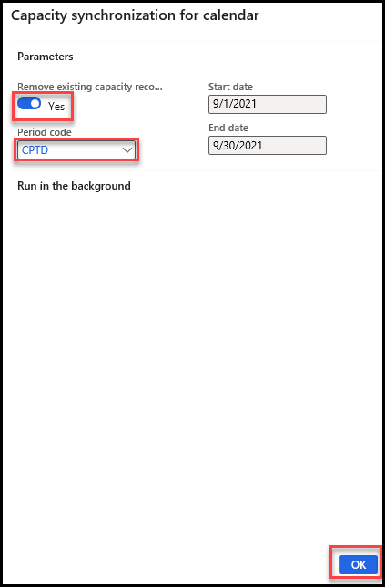

1. Go to **Project management and accounting > Periodic > Project resources > Populate project resources across all companies** and then select **OK**. This is the data upgrade script for general data in the ResProjectResource, ResCalendarDateTimeRange, and ResEffectiveDateTimeRange tables. Values for the PSAPRojSchedRole.RootActivity field are also updated. If this is not run, you will receive a warning when you try to execute resource scheduling operations.

    

1. Create record again (step 1-7)

### Create a goal for the new hire

1. In the Action Pane, select **Worker**.

1. Under the **DEVELOPMENT** tab, select **Goals**. You may need to scroll right to see the tab.

    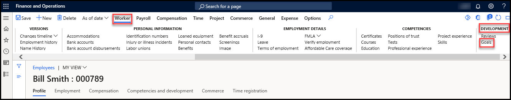

1. In the Action Pane, select **+New** to create a new goal.

1. On the **General** FastTab, enter the following updates:

    | **Setting** | **Value** |
    | :--- | :---- |
    | Name | Quarterly Sales Goal |
    | Overview | Help the store team reach the quarterly sales goal. |
    | Goal category | Sales |
    | Start date | Select a date one week from the current date |
    | End date | Select date 2 weeks after Start date |

1. In the Action Pane, select **Save**.

    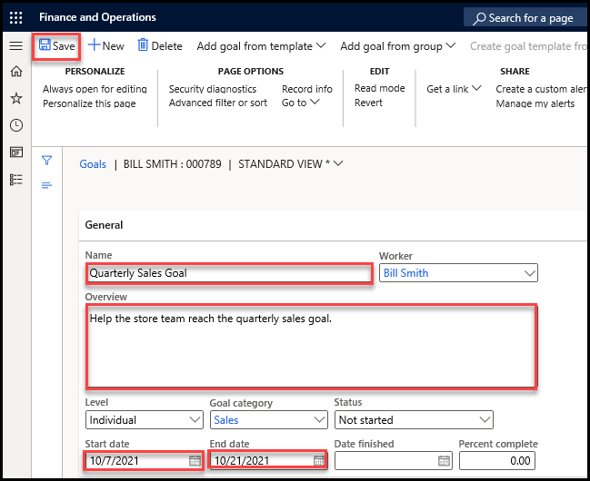

1. Close the Quarterly Sales Goal page.

1. Close the Goals | Bill page.

### Assign learning course to the new hire

1. Using the navigation pane, select **Modules** > **Human resources** > **Workers** > **Employees**.

    

1. In the list of Employees select **Bill Smith**.

1. On the Employees page for Bill, in the Action Pane, select **Worker**

1. Under the **COMPETENCIES** tab, select **Courses**. You may need to scroll right to see the tab.

    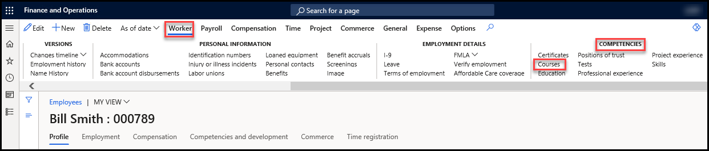

1. In the Action Pane, select **+New** to create a new course.

1. In the grid view, in the **Course ID** column, select the menu and then select **00004**.

1. On the **Transfer course data** dialog box, select **Yes**.

1. In the **Start date** column, select the calendar icon and then select today's date.

1. In the **End date** column, select the calendar icon and then select a date two weeks from today's date.

1. In the Action Pane, select **Save**.

    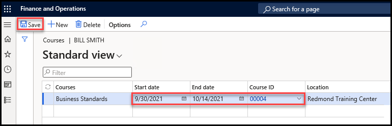

1. Close the Courses | Bill page.

### Create an expense report

1. Using the navigation pane, select **Modules** > **Human Resources** > **Workspaces** > **Employee self service**.

    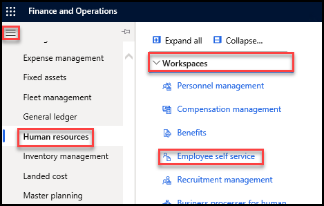

1. Under the **My career information** section, in the **Expenses** tile, select **New Report**.

    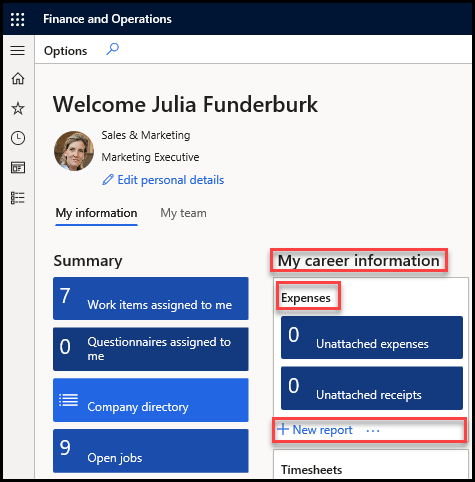

1. In the **New expense report** pane, select the **Purpose** menu, select **Training**, and then select **OK**.

    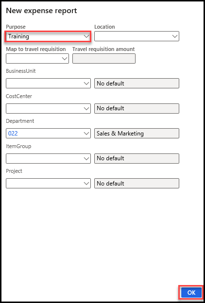

1. In the **Expenses** grid, in the new expense line, enter the following updates:

    | **Setting** | **Value** |
    | :--- | :---- |
    | Transaction date | Select today's date |
    | Expense category | Car Rental |
    | Merchant | LitWare Travel |
    | Transaction amount | 150.00 |

    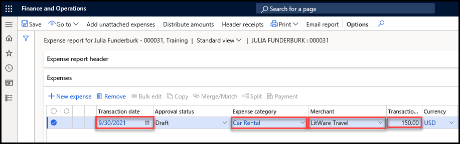

1. Using the lab virtual machine, Go to start menu and type **Notepad** and then click to open **Notepad**.

    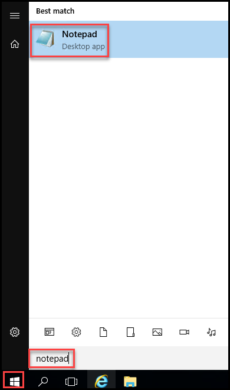

1. In the notepad body, enter **LitWare Travel receipt**.

1. Save the file to the Desktop as **Receipt.txt** and then close Notepad.

1. You will use this file to represent a receipt to attach to an expense report.

1. Return to the Microsoft Dynamics 365 Finance & Operations browser tab in Internet Explorer.

1. In the Action Pane, select **Header receipts**.

1. In the **Header receipts** pane, select **Upload and attach new receipt**.

1. Select **Browse**.

1. Select the **Receipt.txt** file you created earlier and then select **Open**.

1. In the **Notes** box, enter **Car rental** and then select **Upload**.

    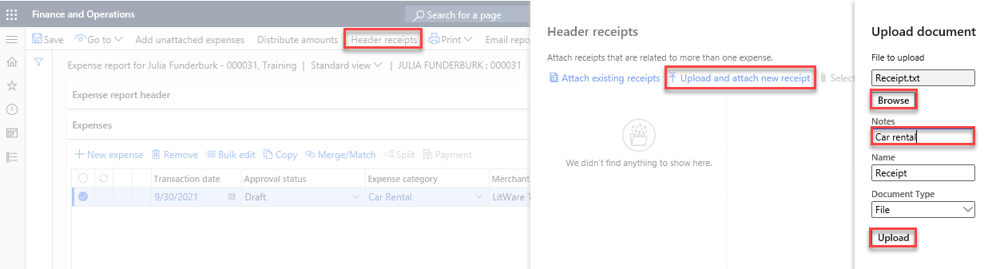

1. Select the **Receipt** check box and then select **Select lines**.

    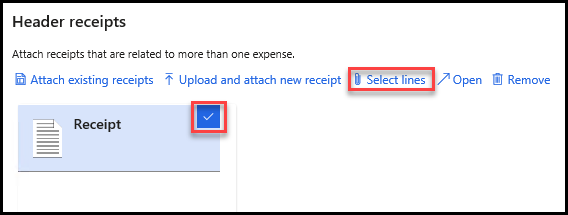

1. In the **Attach receipts to line** pane, select the **150.00 LitWare Travel** check box and then select **OK**.

    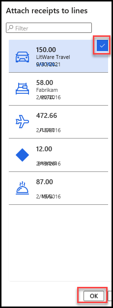

1. Select **Close**.

1. In the Action Pane, select **Workflow** and then select **Submit**.

    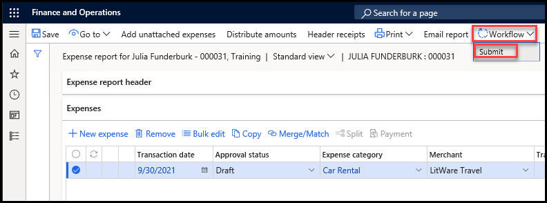

1. In the **Expense report - USMF - Submit** pane, in the **Comments** box, enter **Please review my expense report**.

1. Select **Submit**.

### Record performance journal

1. Using the navigation pane, select **Modules** > **Human resources** > **Performance** > **Performance journal**

    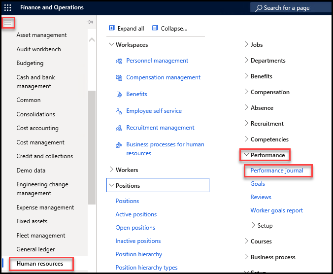

1. In the Action Pane, select **+New**.

1. On the **New journal** page, enter the following updates:

    | **Setting** | **Value** |
    | :--- | :---- |
    | Title | Attended Training |
    | Description | Completed business training for Store Manager |
    | Person | Bill Smith |
    | Date completed | Today's date |

1. In the Action Pane, select **Save**.

    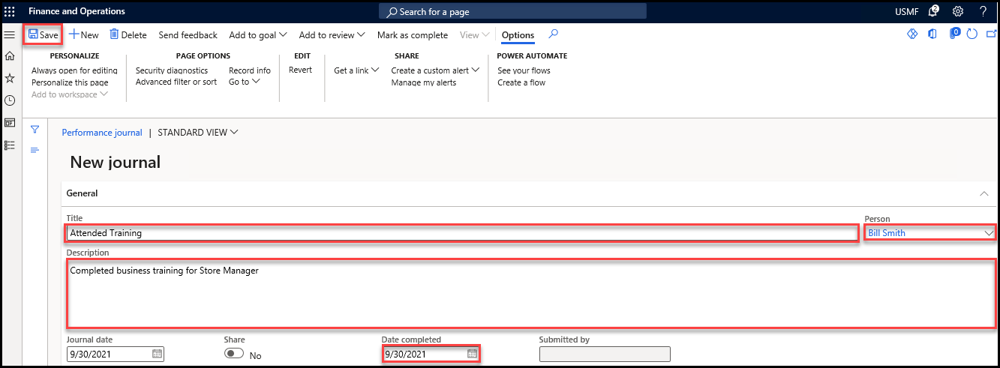

1. In the Action Pane, select **Add to goal**.

1. Select **Quarterly Sales Goal** and then select **OK**.

    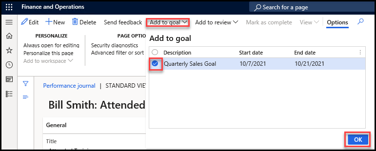

1. Close the Performance journal page.
